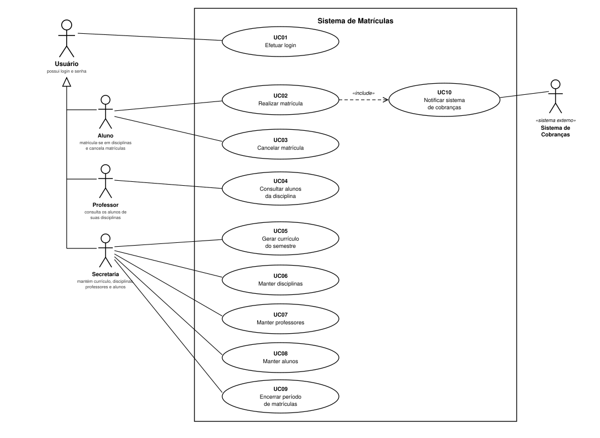
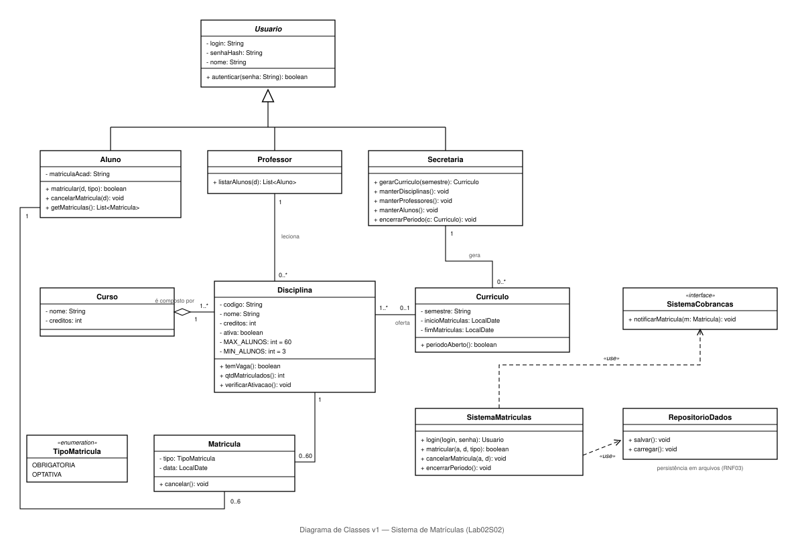

# Sistema de Matrículas

> Laboratório de Desenvolvimento de Software · Engenharia de Software · PUC Minas · 2º semestre/2026
> Prof. Glender Brás — **Laboratório 2: Sistema de Matrículas** (20 pontos)
> Aluno: Lucas Aguiar

Sistema de matrículas para uma universidade, desenvolvido em **Java**: a secretaria gera o currículo de cada semestre e mantém disciplinas, professores e alunos; os alunos se matriculam nas disciplinas dentro do período de matrículas; os professores consultam quem está matriculado; e o sistema de cobranças é notificado a cada matrícula.

## Sumário

- [Status das sprints](#status-das-sprints)
- [Modelo de análise (Lab01S01)](#modelo-de-análise-lab01s01)
  - [Atores](#atores)
  - [Requisitos funcionais](#requisitos-funcionais)
  - [Requisitos não funcionais](#requisitos-não-funcionais)
  - [Regras de negócio](#regras-de-negócio)
  - [Diagrama de casos de uso](#diagrama-de-casos-de-uso)
  - [Histórias de usuário](#histórias-de-usuário)
- [Projeto estrutural (Lab01S02)](#projeto-estrutural-lab01s02)
  - [Diagrama de classes](#diagrama-de-classes)
  - [Estrutura do projeto Java](#estrutura-do-projeto-java)
  - [Como compilar e executar](#como-compilar-e-executar)
- [Tecnologias previstas](#tecnologias-previstas)

## Status das sprints

### 🔄 Lab01S01 — Modelo de análise (4 pontos)
- [x] Requisitos funcionais e não funcionais
- [x] Diagrama de casos de uso ([`docs/diagrama-casos-de-uso-v1.svg`](docs/diagrama-casos-de-uso-v1.svg))
- [x] Histórias de usuário em Markdown (neste README)
- [ ] URL do repositório enviada no Canvas

### ✅ Lab01S02 — Projeto estrutural (4 pontos)
- [x] Revisão dos diagramas (HU09 alinhada à especificação; multiplicidades e tipos completados no diagrama de classes)
- [x] Diagrama de classes ([`docs/diagrama-classes-v1.svg`](docs/diagrama-classes-v1.svg))
- [x] Projeto Java com classes, atributos e stubs dos métodos (`src/sistemamatriculas/`) — compila com JDK 17+

### ⏳ Lab01S03 — Protótipo (7 pontos)
- [ ] Correção dos diagramas conforme feedback
- [ ] Implementação das principais funcionalidades (interface em linha de comando)
- [ ] Persistência em arquivos

---

# Modelo de análise (Lab01S01)

## Atores

| Ator | Descrição |
|---|---|
| **Usuário** | Ator geral: qualquer pessoa com acesso ao sistema. Possui login e senha e precisa se autenticar para usar qualquer função. Os três atores abaixo são especializações dele. |
| **Aluno** | Matricula-se em disciplinas do semestre (4 obrigatórias + 2 optativas) e cancela matrículas, dentro do período de matrículas. |
| **Professor** | Consulta a lista de alunos matriculados em cada uma de suas disciplinas. |
| **Secretaria** | Gera o currículo do semestre e mantém os cadastros de disciplinas, professores e alunos; encerra o período de matrículas. |
| **Sistema de Cobranças** | Sistema externo, notificado pelo sistema de matrículas quando um aluno se matricula, para que a cobrança do semestre seja feita. |

## Requisitos funcionais

| ID | Requisito | Prioridade |
|---|---|---|
| RF01 | O sistema deve autenticar qualquer usuário por login e senha antes de liberar suas funções. | Alta |
| RF02 | A secretaria deve poder cadastrar, alterar, consultar e remover **disciplinas** (nome, créditos, professor responsável, tipo obrigatória/optativa por curso). | Alta |
| RF03 | A secretaria deve poder cadastrar, alterar, consultar e remover **professores**. | Alta |
| RF04 | A secretaria deve poder cadastrar, alterar, consultar e remover **alunos**. | Alta |
| RF05 | A secretaria deve poder gerar o **currículo do semestre**: o conjunto de disciplinas ofertadas, com seu período de matrículas. | Alta |
| RF06 | O aluno deve poder se **matricular** em disciplinas do semestre, escolhendo até 4 disciplinas obrigatórias e até 2 optativas. | Alta |
| RF07 | O aluno deve poder **cancelar** matrículas feitas anteriormente, dentro do período de matrículas. | Alta |
| RF08 | O sistema deve impedir matrículas e cancelamentos **fora do período de matrículas**. | Alta |
| RF09 | O sistema deve **encerrar as inscrições** de uma disciplina quando ela atingir 60 alunos matriculados. | Alta |
| RF10 | Ao final do período de matrículas, o sistema deve **ativar** as disciplinas com pelo menos 3 alunos e **cancelar** as demais. | Alta |
| RF11 | O sistema deve **notificar o sistema de cobranças** quando um aluno se matricular no semestre, para que ele seja cobrado pelas disciplinas escolhidas. | Alta |
| RF12 | O professor deve poder **consultar a lista de alunos matriculados** em cada disciplina que leciona. | Alta |
| RF13 | O aluno deve poder consultar as disciplinas ofertadas no currículo do semestre e as suas matrículas atuais. | Média |

## Requisitos não funcionais

| ID | Requisito | Categoria |
|---|---|---|
| RNF01 | O sistema deve ser desenvolvido em **Java**. | Implementação |
| RNF02 | A interface do protótipo será em **linha de comando** (menus de texto). | Interface |
| RNF03 | Os dados devem ser persistidos em **arquivos** (sem banco de dados). | Persistência |
| RNF04 | As senhas não devem ser armazenadas em texto puro (usar hash). | Segurança |
| RNF05 | Cada tipo de usuário só pode acessar as funções do seu papel (aluno não mantém cadastros, professor não se matricula etc.). | Segurança |
| RNF06 | O sistema deve ser portável entre sistemas operacionais com JVM (Windows/Linux). | Portabilidade |
| RNF07 | Os modelos UML devem ser versionados no repositório junto com o código, refletindo as correções de cada sprint. | Processo |

## Regras de negócio

| ID | Regra |
|---|---|
| RN01 | Cada curso tem nome, número de créditos e é constituído por diversas disciplinas. |
| RN02 | Um aluno pode se matricular em, no máximo, **4 disciplinas obrigatórias** e **2 optativas** por semestre. |
| RN03 | Uma disciplina só ocorre no semestre seguinte se, ao final do período de matrículas, tiver **pelo menos 3 alunos** matriculados; caso contrário, é cancelada. |
| RN04 | Uma disciplina aceita **no máximo 60 alunos**; ao atingir esse número, as inscrições dela são encerradas. |
| RN05 | Matrículas e cancelamentos só podem ocorrer **durante o período de matrículas** definido pela secretaria. |
| RN06 | Toda matrícula gera notificação ao **sistema de cobranças**, para cobrança das disciplinas do semestre. |

## Diagrama de casos de uso



O ator **Usuário** é o ator geral ("pai"): **Aluno**, **Professor** e **Secretaria** são especializações dele e herdam o caso de uso de login, diferindo nas funções que cada papel pode acessar. O **Sistema de Cobranças** é um ator externo: ele não usa o sistema, é notificado por ele (UC10, incluído por UC02 Realizar matrícula).

| Caso de uso | Ator principal | Resumo |
|---|---|---|
| UC01 Efetuar login | Usuário | Autenticação por login e senha (RF01). |
| UC02 Realizar matrícula | Aluno | Matrícula em obrigatórias/optativas no período, respeitando limites (RF06, RF08, RF09; RN02, RN04, RN05). Inclui UC10. |
| UC03 Cancelar matrícula | Aluno | Cancela uma matrícula dentro do período (RF07, RF08). |
| UC04 Consultar alunos da disciplina | Professor | Lista os alunos matriculados nas disciplinas que leciona (RF12). |
| UC05 Gerar currículo do semestre | Secretaria | Define as disciplinas ofertadas e o período de matrículas (RF05). |
| UC06 Manter disciplinas | Secretaria | CRUD de disciplinas (RF02). |
| UC07 Manter professores | Secretaria | CRUD de professores (RF03). |
| UC08 Manter alunos | Secretaria | CRUD de alunos (RF04). |
| UC09 Encerrar período de matrículas | Secretaria | Fecha o período; o sistema ativa disciplinas com ≥ 3 alunos e cancela as demais (RF10, RN03). |
| UC10 Notificar sistema de cobranças | Sistema de Cobranças | Envio da notificação de cobrança a cada matrícula (RF11, RN06). |

## Histórias de usuário

**HU01** — Como **usuário**, quero acessar o sistema com meu login e senha, para que somente pessoas autorizadas usem as funções do meu papel.
*Critérios de aceite:* com credenciais válidas o acesso é liberado para o menu do papel correto; com credenciais inválidas o acesso é negado com aviso.

**HU02** — Como **aluno**, quero me matricular em até 4 disciplinas obrigatórias e 2 optativas, para cursar o próximo semestre.
*Critérios de aceite:* só funciona durante o período de matrículas; o sistema bloqueia a 5ª obrigatória e a 3ª optativa; disciplina cheia (60 alunos) não aceita matrícula.

**HU03** — Como **aluno**, quero cancelar uma matrícula feita anteriormente, para ajustar minhas escolhas antes do fim do período.
*Critérios de aceite:* cancelamento permitido apenas durante o período de matrículas; a vaga volta a ficar disponível.

**HU04** — Como **aluno**, quero consultar as disciplinas ofertadas no semestre e minhas matrículas atuais, para decidir o que cursar.
*Critérios de aceite:* a lista mostra nome, créditos, professor, tipo (obrigatória/optativa) e vagas restantes.

**HU05** — Como **professor**, quero ver a lista de alunos matriculados em cada disciplina que leciono, para me preparar para o semestre.
*Critérios de aceite:* o professor vê apenas suas próprias disciplinas; a lista reflete matrículas e cancelamentos já feitos.

**HU06** — Como **secretaria**, quero manter os cadastros de disciplinas, professores e alunos, para que as informações da universidade fiquem atualizadas.
*Critérios de aceite:* é possível cadastrar, alterar, consultar e remover cada um dos três cadastros; remoções inconsistentes (ex.: disciplina com alunos matriculados) são impedidas.

**HU07** — Como **secretaria**, quero gerar o currículo de um semestre com as disciplinas ofertadas e o período de matrículas, para abrir as inscrições dos alunos.
*Critérios de aceite:* o currículo define quais disciplinas aceitam matrícula e em qual intervalo de datas.

**HU08** — Como **secretaria**, quero encerrar o período de matrículas, para que o sistema ative as disciplinas com pelo menos 3 alunos e cancele as demais.
*Critérios de aceite:* após o encerramento, disciplinas com menos de 3 matriculados ficam canceladas e novas matrículas são bloqueadas.

**HU09** — Como **sistema de cobranças** (sistema externo), quero ser notificado a cada matrícula efetivada, para cobrar o aluno pelas disciplinas do semestre.
*Critérios de aceite:* toda matrícula confirmada gera uma notificação com o aluno e as disciplinas do semestre (conforme especificação do PO).

# Projeto estrutural (Lab01S02)

## Diagrama de classes



Decisões de modelagem:

- **`Usuario`** é abstrata e concentra login/senha e `autenticar()` (RF01, RNF04); `Aluno`, `Professor` e `Secretaria` herdam dela — espelhando a generalização de atores do diagrama de casos de uso.
- **`Matricula`** liga `Aluno` (1 — 0..6, os 4 obrigatórias + 2 optativas da RN02) a `Disciplina` (1 — 0..60, RN04), com o enum **`TipoMatricula`**.
- **`Disciplina`** guarda as regras de lotação como constantes (`MAX_ALUNOS = 60`, `MIN_ALUNOS = 3`) e o método `verificarAtivacao()` aplica a RN03 no encerramento do período.
- **`Curriculo`** representa o que a secretaria gera por semestre: disciplinas ofertadas + período de matrículas (`periodoAberto()` sustenta RF08/RN05).
- **`SistemaMatriculas`** é a fachada que a interface de linha de comando usará, com dependências «use» para a interface **`SistemaCobrancas`** (sistema externo, RF11) e para **`RepositorioDados`** (persistência em arquivos, RNF03).

## Estrutura do projeto Java

```
sistema-matriculas/
├── docs/
│   ├── diagrama-casos-de-uso-v1.svg
│   └── diagrama-classes-v1.svg
├── src/
│   └── sistemamatriculas/
│       ├── Main.java                # ponto de entrada (CLI na Sprint 3)
│       ├── SistemaMatriculas.java   # fachada: login, matricular, cancelar, encerrar período
│       ├── Usuario.java             # abstrata
│       ├── Aluno.java
│       ├── Professor.java
│       ├── Secretaria.java
│       ├── Curso.java
│       ├── Disciplina.java
│       ├── Curriculo.java
│       ├── Matricula.java
│       ├── TipoMatricula.java       # enum OBRIGATORIA/OPTATIVA
│       ├── SistemaCobrancas.java    # interface (sistema externo)
│       └── RepositorioDados.java    # persistência em arquivos
└── README.md
```

Os corpos dos métodos estão como *stubs* (`// TODO: implementar na Sprint 3`), conforme pedido na S02.

## Como compilar e executar

Pré-requisito: **JDK 17+**.

```bash
javac -d bin src/sistemamatriculas/*.java
java -cp bin sistemamatriculas.Main
```

## Tecnologias previstas

- **Java 17+** (sem frameworks), compilado com `javac`/executado com `java`;
- Interface em **linha de comando** (menus de texto);
- **Persistência em arquivos** (texto/CSV);
- **JUnit** para testes das regras de negócio (se houver tempo);
- Modelos UML em `docs/` (versionados: `-v1`, `-v2`, ... conforme as correções de cada sprint).
